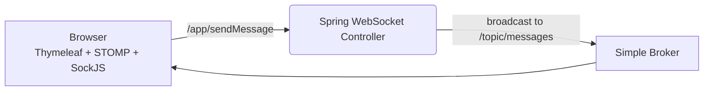

# ChatWithMe — Real‑Time Chat (Spring Boot, STOMP, WebSocket, Thymeleaf)

A lightweight real‑time chat application built with Spring Boot, STOMP over WebSocket (with SockJS fallback), and Thymeleaf. It demonstrates a clean end‑to‑end messaging flow: browser ↔︎ STOMP ↔︎ Spring WebSocket broker ↔︎ subscribers.

> Quick start: `mvn spring-boot:run` then open `http://localhost:8080/chat`

---

## ✨ Features

- **Real‑time messaging** via STOMP over WebSocket with SockJS fallback
- **Publish/Subscribe** pattern using a simple in‑memory broker (`/topic/**`)
- **Clean server mapping**
    - Client sends to **`/app/sendMessage`**
    - Subscribers receive on **`/topic/messages`**
- **Thymeleaf UI** for a minimal, dependency‑light frontend
- **Zero external infra** required—runs entirely on your machine

---

## 🧭 Architecture



**Key endpoints**
- **STOMP App Destination (send):** `/app/sendMessage`
- **STOMP Topic (subscribe):** `/topic/messages`
- **WebSocket (SockJS) endpoint:** `/chat`
- **Page route:** `GET /chat` serves the chat UI

---

## 📂 Project layout (high level)

```
src
└── main
    ├── java/com/chat/ChatWithMe
    │   ├── ChatWithMeApplication.java        # Spring Boot entry point
    │   ├── config/WebSocketConfig.java       # STOMP + WebSocket setup
    │   ├── controller/ChatController.java    # @MessageMapping + view mapping
    │   └── model/ChatMessage.java            # POJO for {sender, content}
    └── resources
        ├── templates/chat.html               # Thymeleaf page + STOMP client
        └── application.properties
```

---

## 🚀 Getting started

### Prerequisites
- **Java 17+** (LTS recommended)
- **Maven 3.9+**

### Run locally
```bash
# from the project root
mvn spring-boot:run
# or, if you have the Maven wrapper in the repo
./mvnw spring-boot:run
```

Open: <http://localhost:8080/chat>

### Build a runnable JAR
```bash
mvn clean package
java -jar target/*-SNAPSHOT.jar
```

---

## ⚙️ Configuration

**WebSocket origin**  
If you host the UI on a different origin, update the allowed origins in `WebSocketConfig`:
```java
registry.addEndpoint("/chat")
        .setAllowedOrigins("http://localhost:8080")
        .withSockJS();
```

---

## 🗺️ Messaging protocol (client side)

```js
const socket = new SockJS('/chat');
const stomp = Stomp.over(socket);

stomp.connect({}, () => {
  stomp.subscribe('/topic/messages', frame => {
    const payload = JSON.parse(frame.body);
    // render { sender, content }
  });
});

// send a message
stomp.send('/app/sendMessage', {}, JSON.stringify({ sender, content }));
```

---

## 🧪 How it works (server)

- `@MessageMapping("/sendMessage")` receives messages from clients.
- `@SendTo("/topic/messages")` broadcasts to all subscribers.
- `@EnableWebSocketMessageBroker` + `configureMessageBroker` enable the simple broker and set app prefixes.

---

## 🗒️ Roadmap

### Core upgrades
- [ ] **Message persistence** (PostgreSQL + Spring Data JPA) with history
- [ ] **Authentication** (Spring Security) — form login
- [ ] **User presence** & **typing indicators** via STOMP user destinations
- [ ] **Multiple rooms** (`/topic/rooms/{id}`) + invite‑only/private rooms
- [ ] **Direct messages** using user‑specific destinations (`/user/queue/..`)
- [ ] **File & image sharing** (S3/MinIO + virus scan)
- [ ] **Message search** (Postgres full‑text)
- [ ] **Moderation** (profanity filters, link‑safe checks)

### Scale & reliability
- [ ] **External STOMP broker relay** (RabbitMQ) for horizontal scaling
- [ ] **Redis** for session sharing and pub/sub cache invalidation
- [ ] **Observability**: Micrometer + Prometheus + Grafana dashboards
- [ ] **Load testing** with k6 or Gatling; include results in README

### Frontend polish
- [ ] **Responsive chat UI** with a modern SPA (React) while keeping STOMP client
- [ ] **Notifications** (browser and in‑app), **reply threads**, **reactions**

---

## 🧑‍💻 Dev notes

- The project uses SockJS, so browsers without native WebSocket still work.
- Keep messages small; the simple broker is in‑memory.
- For scale, move to a broker relay and persist messages to a DB.

---
